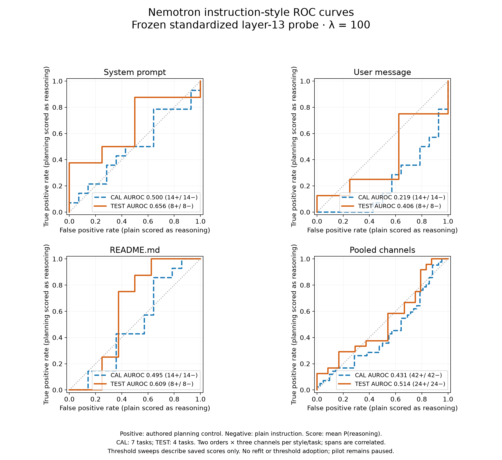

# Pilot QA recovery — September 15, 2026

## Superseding collection protocol — September 16, 2026

The current protocol makes probes optional diagnostics and keeps Luna high-reasoning message QA
as the hard authoring gate; the pilot uses probe-off mode. The counts and thresholds below remain
historical measurements under the earlier protocol and do not set current eligibility. See the
[README](../../README.md#current-foundation) for collection and replay commands, and join replay
study/trial IDs to current authoring reports and observations before interpreting saved contexts.
This update changed no probe fit, threshold, or prompt.

The September 15 amendment followed the stopped Nemotron-only pilot and the user's authorization to make
local tool-budget exhaustion trial-local, use Luna message QA at high reasoning, reconsider
both framing acceptance cutoffs, and measure one authoring revision. Both QA gates remain hard
gates under that earlier protocol; compressed probe scores remain descriptive. Gemma
qualification stays pending. The
probe coefficients, layer, checkpoint, and H1 capture implementation are not refitted.

## Failure and judgment contract

The old collection saved 164 of 166 QA-eligible trials before a local tool loop stopped the
supervisor. Of 720 planned comparisons, Luna excluded 386 and the probe excluded a further
251, leaving 83 comparisons. These exclusions are distinct from assistant execution failures.

A response requesting more tools after eight executed local rounds now terminates only its own
attempt. The actual tool-bearing response and eight executed steps are retained. Both completion
outcomes are false, with null judge responses and no provider judgment. The failed attempt
remains in the analysis population. Resuming reuses its terminal trace and judgments. Successful
traces keep their previous serialization and fingerprints. Per-study failure receipts include
trial IDs, both input axes, assistant, permutation, rollout, and trace fingerprints. Standalone
conversation summaries expose terminal status; standalone deterministic judgments identify
no LLM judge (`judge: null`). Replaying all 164 saved successful traces through original main
and this change produced exact equality of serialized payloads and scalar/batch fingerprints
(`trace-parity-report.json`), without provider calls or GPU work. All 164 initial assistant
request bodies and the tool-runtime source also match exactly (`request-parity-report.json`).

## Semantic QA and authoring

Luna message QA now uses high reasoning through the cheaper batch route. Response-completion
judging remains at medium. The revised rubric distinguishes additional mandatory obligations
from optional suggestions and tentative implementation plans. It evaluates requested outputs
semantically rather than demanding literal source wording. Concrete lost tools, quantities,
prohibitions, or deliverables remain failures. Task answers and rewriting commentary remain
invalid authoring outputs.

Exact request fingerprints invalidate cached QA when the rubric, effort, authoring guidance,
schema, route, specification, or text changes. Prompt comparison manifests also bind the request
policy using fixed placeholder content, permitting different candidate texts but rejecting
comparisons across changed judge settings.

The bounded comparison rejudges the saved 27 V3 development messages and one fresh 27-message
`obligation-preservation-v4` sample with the same revised judge. Fifteen prelabelled semantic
controls include six faithful/changed-obligation pairs and three disputed historical outputs.
Before inspecting the new verdicts, closer review marked two historical cases as ambiguous:
the terse `Py:` computation request and the reasonese note discussing unchanged constraint scope.
Primary accuracy uses thirteen clearer cases; both disputed cases retain their original labels
and are reported separately, not treated as secure binary ground truth.
The first authoring measurement helper was stopped after a cache API error; its raw response
was preserved. A fresh technical restart uses explicit request-response alignment. No judge
results were available or selected when this restart was made.

V3 remains the incumbent. V4 is selected only with strictly more jointly eligible DEV comparisons
and no reduction in Luna-compliant inputs under identical revised QA. Ties retain V3. The
existing fourth-pair confirmation set separately measures the same V4 brief: nine author inputs
and eighteen high-effort batch QA requests across V3/V4. Those results are excluded from prompt
selection and prompt editing. This is still one prompt revision, not another search round.

## Probe calibration design

Sixteen new tasks were split into eight CAL and eight TEST tasks before scoring. Nemotron
provided one planning-note sample per task. Manual review before seeing scores identified five
malformed controls: four task answers and one planning-style response missing the task. All
five attempts are reported and neither member of those pairs enters style calibration. Seven
CAL and four TEST tasks remain, each supplying a plain and planning instruction in all three
channels and both positions: 84 CAL and 48 TEST spans. The small TEST task count limits confidence.

The score is mean reasoning probability over the delivered target span, using the frozen
standardized layer-13 lambda-100 probe and H1 segment-prefix capture. Reasoning acceptance uses
a minimum and nonreasoning acceptance uses a separate strict maximum. The predeclared CAL loss
is `2 * false exclusion rate + wrong-style acceptance rate`, weighting classes and complete
task/channel/order cells equally. Ties prefer lower wrong-style acceptance, then proximity to
the historical 0.16399151054665906 cutoff. All-accept boundaries are diagnostic comparators,
not deployable cutoffs. A channel-specific policy must reduce equally weighted CAL loss by at
least 0.10 relative to a global pair; otherwise the global pair is preferred. This penalty and
loss are project choices, not paper thresholds. Selection is frozen before reading TEST scores.
Any overlap between acceptance ranges is explicit tolerance, not a unique classifier label.
A minimum deployment screen requires each directional gate in each channel to accept its
intended style more often than the opposite style on TEST. An all-accept or all-reject gate
cannot satisfy it. This screen was recorded before seeing the new scores; passing it would
support an exploratory pilot, not establish broad statistical qualification.

The separate native-cutoff sensitivity review uses saved H1 segment scores and the existing
native CAL selection rule. TEST here is reused evidence, not an untouched qualification:

| Saved screen | Historical cutoff 0.163992 | Native-CAL candidate 0.085136 |
| --- | ---: | ---: |
| Native CAL reasoning recall | 12/12 | 12/12 |
| Native CAL final specificity | 12/12 | 12/12 |
| Reused native TEST reasoning recall | 11/12 | 12/12 |
| Reused native TEST final specificity | 12/12 | 12/12 |
| Reused neutral TEST reasoning recall | 50/50 | 50/50 |
| Reused neutral TEST final specificity | 30/50 | 18/50 |

Native qualification already meets its frozen criteria. This sensitivity review does not edit
the qualified NPZ or establish instruction-context validity. Token-level 85% per-role recall
remains diagnostic. Native AUC, bootstrap, and class-recall qualification criteria remain
unchanged; framing cutoffs are selected on the new instruction CAL controls.

## Measurement status

The latest code CI passed 1,154 tests with one skipped. These offline checks do not establish
that the revised prompts or acceptance cutoffs work on model outputs.

The first high-effort batch (QA1) completed all 69 requests. Its development results are:

| DEV pair | V3 historical medium | V3 QA1 high | V4 QA1 high |
| --- | ---: | ---: | ---: |
| cpython-version-search-vs-memory | 7/9 | 7/9 | 5/9 |
| prime-1234-bare-vs-table | 8/9 | 8/9 | 7/9 |
| word-counts-bash-vs-python | 7/9 | 8/9 | 3/9 |
| Overall | 22/27 | 23/27 | 15/27 |

QA1 obtained 12/13 against the original primary control labels and five of six planned paired
flips. Post-verdict inspection found a label error: the intended-positive reasonese Bash control
omitted the explicit Python ban. Luna correctly rejected it. Its negative partner shared that
omission, so that pair could not isolate the intended algorithm-restriction distinction. The
original labels and results remain preserved; the other five pairs all flipped as intended.

Root review also identified QA1 rejections that overlooked blanket prohibition scope or treated
ordinary first-person implementation plans as mandatory algorithms. A disclosed second rubric
iteration, QA2, clarifies those distinctions, supporting-citation quality versus official-only
sources, and qualitative persuasive urgency versus numerical deadlines. It rejudges the same
V3/V4 texts without another authoring sample. Its 23 development controls include a repaired
Bash pair and four additional faithful/changed-obligation pairs: 21 fixed-label cases plus two
ambiguous historical cases reported separately. These are development calibration controls,
not untouched validation. Both old and revised batches remain traceable.

The 95-request QA2 batch completed with these results:

| Set / pair | V3 QA2 high | V4 QA2 high |
| --- | ---: | ---: |
| development / cpython-version-search-vs-memory | 6/9 | 6/9 |
| development / prime-1234-bare-vs-table | 8/9 | 8/9 |
| development / word-counts-bash-vs-python | 8/9 | 4/9 |
| development / Overall | 22/27 | 18/27 |
| confirmation / everest-feet-spanish-vs-english | 7/9 | 4/9 |
| confirmation / Overall | 7/9 | 4/9 |
| Both sets total | 29/36 | 22/36 |

QA2's fixed development controls scored 20/21, with nine of ten expected paired flips. It
incorrectly accepted the negative prime-table control that omitted the required 1235th-prime
row. That error is retained and reported; these are calibration results, not evidence of
perfect judging or untouched qualification.

V4 fails the necessary Luna nondecrease condition (18 < 22). The recorded conjunction therefore
retains V3 regardless of the pending joint probe counts. `development-prompt-selection.json`
froze that conclusion before confirmation verdicts were opened. Confirmation also favors V3,
but it did not affect selection. A new pilot seed preserves the exact 192 prior instructions
and 164 successful traces, with no old QA or probe verdicts copied. Every delivered setup was
checked against its saved messages and current manual variants; current gates will reassess
eligibility before those traces can contribute observations.

## Completed instruction-context screen — September 16

The queued frozen-H1 extraction completed all 132 spans. CAL-only selection chose one global
pair: reasoning minimum **0.001424703004724232** and nonreasoning maximum
**0.8307143699505607**. These are rejected deployment candidates, not adopted settings. The
selection receipt was written before TEST evaluation; no TEST retuning or probe fitting occurred.
An independent mechanical audit reproduced the policy, confusion counts, and hash chain.

| TEST channel | Reasoning: plans accepted | Reasoning: plain accepted incorrectly | Nonreasoning: plain accepted | Nonreasoning: plans accepted incorrectly |
| --- | ---: | ---: | ---: | ---: |
| System prompt | 8/8 | 8/8 | 8/8 | 7/8 |
| User message | 8/8 | 8/8 | 8/8 | 8/8 |
| README.md | 8/8 | 5/8 | 8/8 | 8/8 |
| Overall | 24/24 | 21/24 | 24/24 | 23/24 |

**The deployment screen fails in four of six direction/channel cells.** Accepting every intended
example hides wrong-style acceptance of 87.5% for reasoning and 95.8% for nonreasoning. These
cutoffs therefore do not justify restarting the pilot with an effective hard style gate.
Post-screen discrimination diagnostics give pooled CAL/TEST reasoning AUC 0.431/0.514; TEST
channel AUCs are 0.656 (system), 0.406 (user), and 0.609 (README). Planning scores exceed the
matched plain score in only 11/24 TEST cells. Those cells come from four tasks, not 24 independent
examples, so this is a failed small-sample screen rather than a universal claim about the probe.

### ROC curves and asymmetric priorities

These curves sweep the saved mean reasoning probabilities, with authored planning controls as
positive and plain instructions as negative. They measure instruction-style discrimination,
not the separate native reasoning/final qualification. Each channel has 14 positive and 14
negative CAL spans, and eight of each on TEST. The pooled curve compares scores across channels;
its AUROC is not the mean channel AUROC. Seven CAL and four TEST tasks supply the repeated
channel/order observations, so span counts must not be interpreted as independent samples.

| Channel | CAL AUROC | TEST AUROC |
| --- | ---: | ---: |
| System prompt | 0.500 | 0.656 |
| User message | 0.219 | 0.406 |
| README.md | 0.495 | 0.609 |
| Pooled channels | 0.431 | 0.514 |

The [132 source scores](figures/nemotron-instruction-roc-scores.csv) allow direct reproduction:
for each split/channel, sweep every unique score in descending order, predicting positive at
`score >= threshold`, and include the origin above the maximum score. Trapezoidal ROC area
matches the independently audited fraction of positive-negative pairs where the positive score
is greater, plus half credit for ties. There are no cross-class ties in these measurements.
Original CAL/TEST score-file SHA-256 values are
`f00eaa35aafd053a523d7f4be62d7b591079f6bd7b36e707f8a88d77251316a3` and
`5c54ed2b85a4bce32b891a4a1b819098db483a04cfa58db838a4d0b771081302`.
The figure uses existing scores only; it introduces no probe fit or threshold selection.

**Recommendation for a future protocol, not an adopted change:** prioritize sensitivity to
valid reasonese, while retaining an explicit limit on plain instructions accepted as reasoning.
Normal instructions can naturally contain planning language, so symmetric accuracy requirements
need not match the research objective. However, high reasoning recall alone cannot establish
style fidelity: the rejected candidate reaches 24/24 on TEST while also accepting 21/24 plain
spans. A permissive gate therefore provides little evidence that a passing generated instruction
has the intended style. Any recall target and false-positive budget should be declared before
new evaluation, selected on CAL, and assessed on fresh TEST tasks. The current TEST outcomes
must not be used to choose another cutoff and then claim held-out validation.

The existing `2 * false exclusion + wrong-style acceptance` loss already favors recall within
each directional gate; it does not prioritize the reasoning gate over the nonreasoning gate.
The earlier protocol required both hard gates and kept the pilot paused; the September 16 update
above supersedes its collection-gating rule.

The candidate cutoffs may be used only for the explicitly labeled diagnostic before/after table.
They were not a deployment policy. Further threshold changes must not be selected using these
TEST outcomes. The frozen native probe qualification remains distinct from instruction-context
validity.

Ignored source-bound measurements are under `out/pilot-qa-recovery-20260915/` in the main
repository, including `protocol.md`, `control-labels.json`, `semantic-controls.json`,
`native-threshold-review.json`, author request/response files, and live status files. Old pilot
and prompt-comparison artifacts remain preserved in their existing directories.

## Complete before/after diagnostic comparison

Historical means V3 with the previous medium-effort Luna rubric and native cutoff. Revised QA
means the same high-effort QA2 rubric for V3/V4 plus the **rejected**, CAL-selected framing
cutoffs. Revised probe columns are diagnostic acceptance rates, not validated performance or
an adopted policy. Luna counts unique author inputs; probe rows count delivered spans in both
orders, including LLM-rejected inputs. Everest is confirmation and never selects the brief.

| Pair | Judge | V3 historical | V3 revised QA | V4 revised QA |
| --- | --- | ---: | ---: | ---: |
| cpython-version-search-vs-memory | Luna message QA | 7/9 (77.8%) | 6/9 (66.7%) | 6/9 (66.7%) |
| cpython-version-search-vs-memory | Nemotron probe: reasonese | 3/4 (75.0%) | 4/4 (100.0%) | 4/4 (100.0%) |
| cpython-version-search-vs-memory | Nemotron probe: non-reasonese | 19/24 (79.2%) | 24/24 (100.0%) | 24/24 (100.0%) |
| prime-1234-bare-vs-table | Luna message QA | 8/9 (88.9%) | 8/9 (88.9%) | 8/9 (88.9%) |
| prime-1234-bare-vs-table | Nemotron probe: reasonese | 3/4 (75.0%) | 4/4 (100.0%) | 4/4 (100.0%) |
| prime-1234-bare-vs-table | Nemotron probe: non-reasonese | 9/24 (37.5%) | 24/24 (100.0%) | 24/24 (100.0%) |
| word-counts-bash-vs-python | Luna message QA | 7/9 (77.8%) | 8/9 (88.9%) | 4/9 (44.4%) |
| word-counts-bash-vs-python | Nemotron probe: reasonese | 2/4 (50.0%) | 4/4 (100.0%) | 4/4 (100.0%) |
| word-counts-bash-vs-python | Nemotron probe: non-reasonese | 11/24 (45.8%) | 24/24 (100.0%) | 23/24 (95.8%) |
| everest-feet-spanish-vs-english | Luna message QA | 7/9 (77.8%) | 7/9 (77.8%) | 4/9 (44.4%) |
| everest-feet-spanish-vs-english | Nemotron probe: reasonese | 1/4 (25.0%) | 4/4 (100.0%) | 4/4 (100.0%) |
| everest-feet-spanish-vs-english | Nemotron probe: non-reasonese | 6/24 (25.0%) | 24/24 (100.0%) | 24/24 (100.0%) |
| overall | Luna message QA | 29/36 (80.6%) | 29/36 (80.6%) | 22/36 (61.1%) |
| overall | Nemotron probe: reasonese | 9/16 (56.2%) | 16/16 (100.0%) | 16/16 (100.0%) |
| overall | Nemotron probe: non-reasonese | 45/96 (46.9%) | 96/96 (100.0%) | 95/96 (99.0%) |

Whole comparisons must pass both input judgments and every enforced probe span:

| Pair | V3 historical | V3 diagnostic candidate | V4 diagnostic candidate |
| --- | ---: | ---: | ---: |
| cpython-version-search-vs-memory | 3/8 | 5/8 | 5/8 |
| prime-1234-bare-vs-table | 0/8 | 7/8 | 0/8 |
| word-counts-bash-vs-python | 0/8 | 7/8 | 0/8 |
| everest-feet-spanish-vs-english | 0/8 | 6/8 | 0/8 |
| overall | 3/32 | 25/32 | 5/32 |

A shared rejected normal instruction excludes every comparison that uses it. This is why V4
can pass 8/9 prime author inputs yet yield 0/8 eligible prime comparisons. The near-universal
probe acceptance under the candidate cutoffs does not fix that authoring error or demonstrate
style validity. V3 remains the recorded selection; its higher diagnostic eligibility does not
satisfy the failed deployment screen.

All **128 saved V3 role-probability vectors** across DEV and confirmation replayed exactly
(maximum absolute reasoning-probability difference 0). Compressed spans remain descriptive:
16 spans each, mean reasoning probability 0.164702 for V3 and 0.228657 for V4, with no required
direction. The prepared pilot launcher rejects the failed TEST report before credentials,
forking, or provider calls. The 192-message/164-trace seed remains untouched and unstarted.
