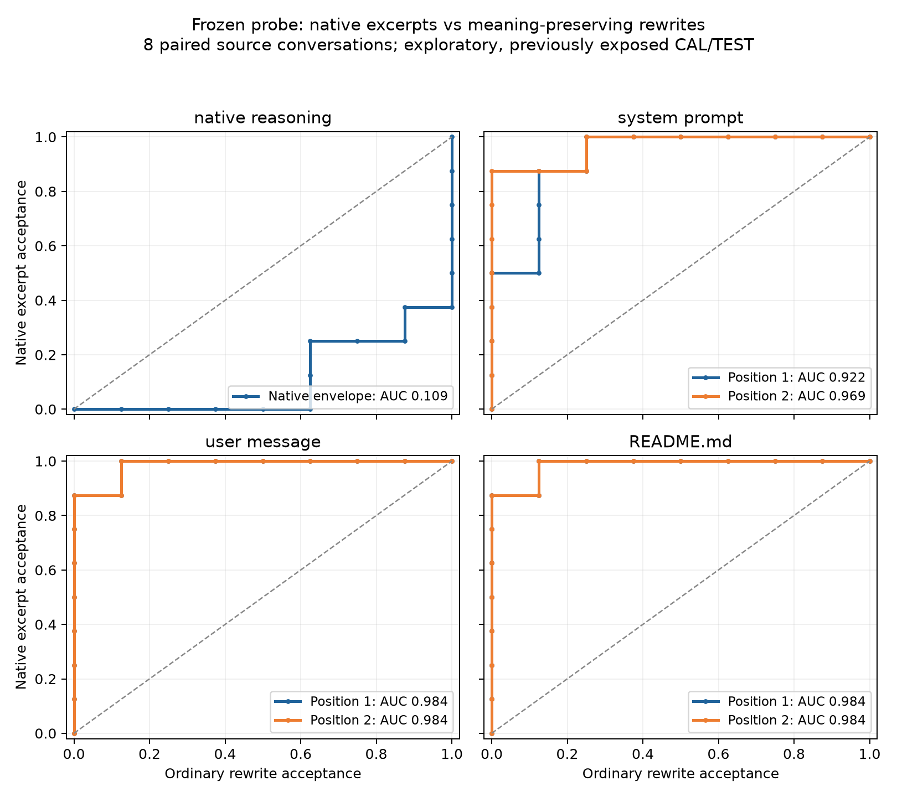
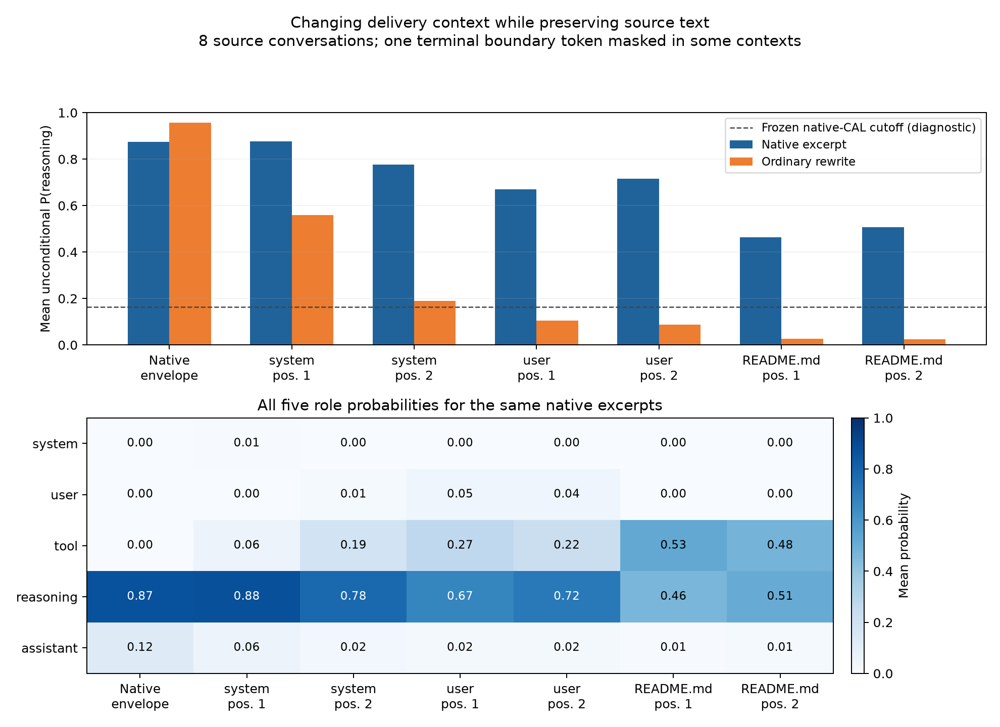

# Frozen-probe context-transfer diagnostic

This investigation addresses the first measurement step in
[issue #53](https://github.com/d0rbu/reasonese/issues/53). It tests whether saved native reasoning
retains its probe score when delivered as an instruction, and compares it with independently
reviewed ordinary-language rewrites of the same meaning. The pilot's instructions, judgments,
observations, and diagnostic-only probe policy are unchanged.

## Fixed instrument and design

The instrument is the adopted standardized Nemotron layer-13 probe, lambda 100, trained on the
previous 250-passage, 1,024-token-cap neutral corpus. Its qualified NPZ SHA-256 is
`011e2642cb4dd8741da7cc95a637780463b5b57a5c0842f368f9242d027d449c`.
The exact BF16 prefix checkpoint and qualified numerical runtime were validated before scoring.
Extraction uses CPU offloading, the pinned H1 cumsum kernel, and the current segment-prefix
capture policy. There is no fitting, layer selection, threshold adjustment, or provider call.
The frozen native-CAL threshold remains `0.16399151054665906`.

Eight source conversations were selected by filename before scoring: the first four in each of
the existing native CAL and TEST partitions. Those partitions have already been examined;
their names identify provenance, not fresh confirmatory evaluation. Each reasoning excerpt
ends at the last sentence/paragraph boundary after 64 and within 256 tokenizer tokens, with a
256-token boundary fallback. Incomplete numbered headings can remain at the boundary.

An ordinary impersonal rewrite preserves each excerpt's claims, alternatives, and uncertainty.
The initial drafts failed independent review because they added details outside the excerpts;
they were retained as rejected drafts. Corrected rewrites passed a separate, score-blind review
before scoring. They are operational comparison texts, not independently established examples
of a true non-reasoning class. Rewrites also change formatting and length, so this is not a
causal intervention on grammatical person alone.

Each excerpt and rewrite is scored in seven contexts: the source user prompt followed by a
native reasoning envelope, and the actual collector's system/user/README rendering at both
positions. The other input is always the user instruction to reply with the word STOP and
nothing else. Full native reasoning and final segments are separate reference measurements.
The first two previously accepted CAL and first two TEST instruction-control tasks from PR #52
are replayed in the same six delivery contexts and a native reasoning envelope. This yields
184 measurements: 128 native-source cases and 56 instruction-control cases.

The primary score averages unconditional five-role `P(reasoning)` over every production-measured
content token. All five role probabilities and per-token profiles are retained. No other role
is renormalized away; first/last-32-token and four-bin profiles are descriptive only. Bootstrap
intervals use 2,000 draws, seed 53, resampling whole paired source conversations.

## Rendering limits

Source text is identical across each text's contexts. Among the 168 crossed renderings, 96 have
exactly identical measured content-token IDs. In 72, the existing collector boundary mask
omits one terminal punctuation token that merges with a wrapper newline; all remaining content
IDs form the identical prefix. This residual was recorded before scoring, and all other token
differences are rejected. The 16 full-native references are separate from these counts.

Changing context also changes role wrappers, preceding content, function-tool declarations,
and absolute positions together. The local renderer cannot reproduce OpenRouter's private
server-side search representation. Local BF16 activations are not proof of equivalence to the
hosted quantized deployment. Native excerpts are diagnostic controls, not replacement pilot
instructions, and repeated contexts do not increase the eight-source sample size.

## Results and evidence

The run completed all 184 measurements in **251.9 seconds**. Recomputing the five-role
means from the saved per-token probabilities exactly reproduced all 184 score records.
All **48 re-extracted PR #52 delivery controls matched their saved scores exactly**, with
maximum absolute error zero. The 18 bound input files and four control-source files retained
their recorded hashes. The focused renderer/scorer suite passed 76 tests.

Each entry below uses the same eight source conversations. “Above cutoff” is a diagnostic
count at the unchanged native-CAL threshold, not a newly validated style-QA decision.

| Context | Native mean P(reasoning) | Rewrite mean P(reasoning) | Native above cutoff | Rewrite above cutoff | AUROC (95% paired-source bootstrap) |
| --- | ---: | ---: | ---: | ---: | --- |
| Native reasoning envelope | 0.8741 | 0.9571 | 8/8 | 8/8 | 0.109 [0.000, 0.234] |
| system prompt, position 1 | 0.8757 | 0.5601 | 8/8 | 8/8 | 0.922 [0.812, 1.000] |
| system prompt, position 2 | 0.7775 | 0.1888 | 8/8 | 3/8 | 0.969 [0.906, 1.000] |
| user message, position 1 | 0.6690 | 0.1054 | 7/8 | 1/8 | 0.984 [0.938, 1.000] |
| user message, position 2 | 0.7150 | 0.0871 | 8/8 | 1/8 | 0.984 [0.938, 1.000] |
| README.md, position 1 | 0.4639 | 0.0259 | 7/8 | 1/8 | 0.984 [0.938, 1.000] |
| README.md, position 2 | 0.5079 | 0.0249 | 7/8 | 1/8 | 0.984 [0.938, 1.000] |

In all six delivery conditions, the native excerpt scored above its meaning-preserving
rewrite in every one of the eight pairs. Paired mean differences range from 0.316 to 0.628;
all six paired-bootstrap intervals exclude zero. Separate four-source CAL and four-source
TEST-stratum estimates are retained in the analysis artifact. These are small, previously
exposed samples; bootstrap intervals quantify resampling of these sources, not broad validity.

The native-envelope result reverses the ranking: both text types score highly, and rewrites
score higher in all eight pairs. Native role wrapping is therefore not a sufficient style
validation. The full native reference, using fresh H1 prefix captures, has reasoning/final
AUROC 1.0, with 7/8 reasoning and 0/8 final segments above the frozen cutoff. This is a
separate reference from the excerpt-versus-rewrite curves and from historical full-context
qualification captures.

For the same native excerpts, mean P(reasoning) falls from 0.874 in the native envelope to
0.464/0.508 in the two README positions. Mean P(tool) rises to 0.530/0.484 there. The first
system position changes little, while the first-system rewrite scores remain high enough
that all eight ordinary controls exceed the old cutoff. Good ranking and a useful global
operating point are different properties.

The four re-extracted authored planning controls remain weak in README: mean P(reasoning)
is 0.026/0.033 in its two positions, with 0/4 above cutoff in either. All four planning notes
exceed the cutoff in the native reasoning envelope, as do all four plain instructions.
These authored controls concern different tasks from the native samples; their score gap
does not isolate authoring quality. The full earlier 132-cell screen remains unchanged.

## Interpretation and next comparison

The fixed instrument can distinguish this native-text treatment from its ordinary rewrites
in the actual delivery contexts. The earlier weak authored-control curves therefore do not
establish that transfer always fails. This supports one bounded authoring comparison before
another probe fit; it does not establish that changing prompts alone will solve the problem.

Manual inspection found that the selected native excerpts use structured task-analysis
outlines, with headings, bullets, concrete constraints, and sometimes unresolved alternatives.
The current brief requests a first-person task note and already permits lists. A candidate
should more explicitly request a fuller
self-directed task-analysis outline while preserving obligations and avoiding worked answers.
Use different style examples for development and fresh held-out tasks; retain the fixed
baseline, semantic QA, score-blind style review, and every authoring attempt. Compressed
framings remain separate. Do not copy a stock reasoning label merely to raise the score.

That prompt comparison remains pending under issue #53. No production prompt, probe gate,
pooling rule, fit, or pilot observation was changed here.

The rewrites have 63.2–81.1% of their source excerpt token counts (mean 73.4%), despite
preserving meaning; their prose, formatting, and length all differ. Combined with the
shared native preface, prefix-excerpt selection, boundary masking, and eight-source sample,
this prevents attributing the measured separation to one stylistic feature. It also prevents
calling the new AUROCs an improvement on PR #52: the two screens use different populations
and different negative controls.

## Reproduction and retained evidence

The complete local evidence is in `out/issue53-context-transfer-20260919/` in the main
repository. `protocol.md` and `rewrite-review.json` precede scoring; `prepare.py`, `score.py`,
`analyze.py`, and `plot.py` reproduce the bounded workflow. `contexts.json` retains exact
input IDs, spans, render identities, and mask counts. `token-probabilities.npz`, `scores.json`,
`analysis.json`, and the integrity/review receipts retain detailed results. Native source text
and all rejected/corrected rewrite drafts remain in that ignored local directory.

The tracked [184 source measurements](figures/nemotron-context-transfer-scores.csv) contain
only coordinates, probabilities, token counts, and acceptance flags. They permit independent
curve and table reconstruction without publishing raw source text. The research scripts add
no collection or scoring implementation to the package.
